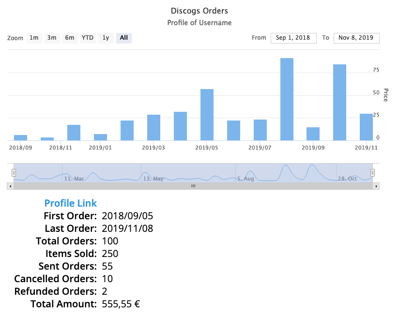

# discogs-visualizer

App to visualize different data from [Discogs](https://www.discogs.com) marketplace. Currently it shows only your sells. It uses [disconnect](https://github.com/bartve/disconnect), a Node.js client with OAuth for the connection to the [Discogs API](https://www.discogs.com/developers).

## Front End

The front end application is build with [Next.js](https://nextjs.org/) and Highstock from [Highcharts](https://www.highcharts.com).

## Local Development

For local development you need to install npm dependencies and run the Next.js application. You also need to create an application on the [Discogs Developer Settings Page](https://www.discogs.com/settings/developers) after you logged in. You need to rename to .env.template file and fill it with your credentials.

[`npm`](https://www.npmjs.com) is used for front end dependency management.

```bash
$ npm install
...
$ npm run dev
```

Afterwards you can just start the application in your browser with localhost:3000


